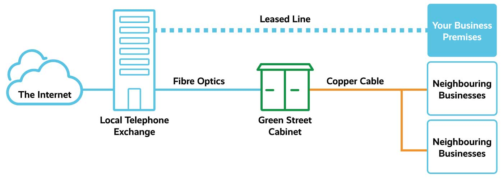
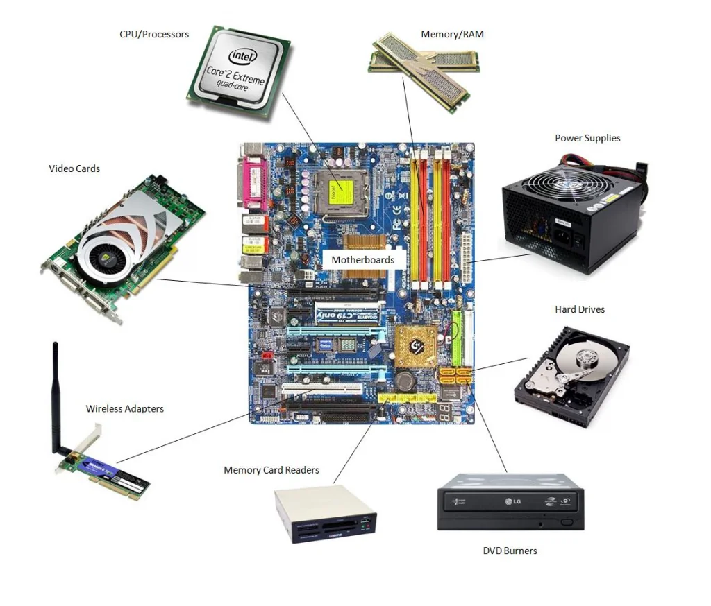
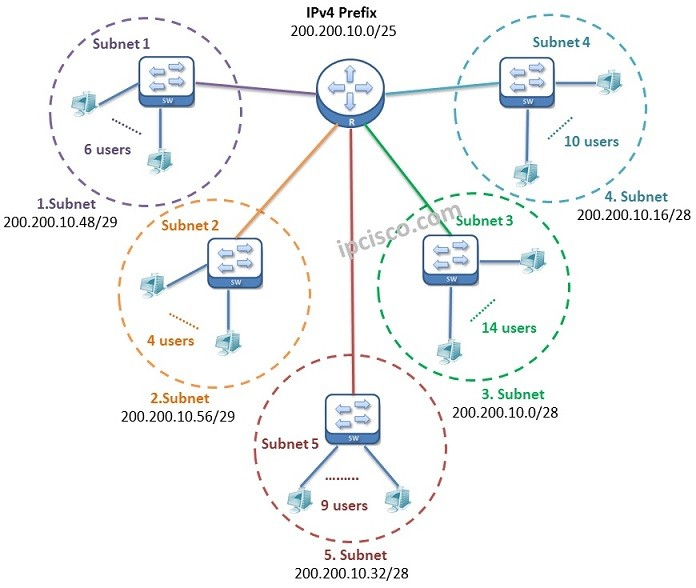
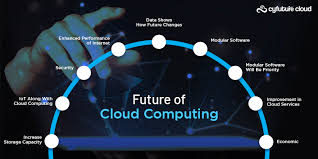

# Infrastructure Basics

## Table of Contents

1. [Introduction to Infrastructure](#introduction-to-infrastructure)
2. [The Role of Data Centers](#the-role-of-data-centers)
3. [Hardware and Servers](#hardware-and-servers)
4. [Networking Fundamentals](#networking-fundamentals)
5. [The Internet and Cloud](#the-internet-and-cloud)
6. [Virtualization and Containers](#virtualization-and-containers)
7. [DevOps and Infrastructure as Code](#devops-and-infrastructure-as-code-iac)
8. [Monitoring and Automation](#monitoring-and-automation)
9. [Security and Compliance](#security-and-compliance)
10. [The Future of Infrastructure](#the-future-of-infrastructure)
11. [Images & Visual Aids](#images--visual-aids)

---

## Introduction to Infrastructure

Infrastructure refers to the foundational physical and virtual systems that support the operation and delivery of applications, services, and data. It is the backbone that enables businesses to operate in a connected and digital environment.

### Key Elements of Infrastructure:
- **Hardware**: Physical machines such as servers, storage, and networking equipment.
- **Virtualization**: Layering technology that allows the creation of virtual instances of hardware resources.
- **Networking**: Ensures connectivity between machines and the internet.
- **Cloud**: On-demand access to computing resources like servers and storage over the internet.

---

## The Role of Data Centers


A **Data Center** is a specialized facility that provides computing resources, storage, and networking capabilities essential for the functioning of applications, websites, services, and other computing tasks.

### Key Components of a Data Center:
1. **Servers**: 
   - **Function**: Servers are the backbone of any data center, responsible for processing data, running applications, and performing computing tasks.
   - **Server Types**:
     - **Rack Servers**: Modular servers that are mounted in racks.
     - **Blade Servers**: Compact servers designed for energy efficiency.
     - **Virtual Servers**: Hosted in a virtualized environment using hypervisors.
2. **Storage Systems**: 
   - **Function**: Systems used to store data that is accessed by servers, applications, and users.
   - **Types**:
     - **HDDs**: Traditional storage devices.
     - **SSDs**: Faster storage based on flash memory.
     - **SAN**: High-speed networked storage.
     - **Cloud Storage**: Scalable storage offered by cloud providers.
3. **Networking Equipment**:
   - **Function**: Devices that manage data traffic within and outside the data center.
   - **Components**:
     - **Routers, Switches, Firewalls, Load Balancers**.
4. **Cooling Systems**:
   - **Function**: Systems to manage heat generated by servers and networking equipment.
   - **Types**:
     - **Air Cooling**: Common method using cold air.
     - **Liquid Cooling**: More efficient method using coolant.
5. **Power Supply**:
   - **Function**: Ensures continuous power to the data center.
   - **Components**:
     - **UPS**: Uninterruptible Power Supply.
     - **Generators**: Backup power for extended outages.

---

### Types of Data Centers:
1. **Private Data Centers**: Owned and operated by companies.
2. **Public Data Centers**: Hosted by cloud providers like AWS, Google Cloud.
3. **Hybrid Data Centers**: A mix of private and public cloud.

---

### Evolution of Data Centers in DevOps
The rise of **DevOps** has transformed data centers. With **virtualization**, **cloud computing**, and **containerization**, data centers are now more agile, scalable, and automated.

---

### How Data Centers Fit in a DevOps Pipeline
1. **Infrastructure as Code (IaC)**: Tools like **Terraform** automate the management of data center resources.
2. **Scalability**: Auto-scaling features allow DevOps teams to scale applications rapidly.
3. **High Availability**: Redundant systems and failover mechanisms ensure consistent uptime.

---

### Future of Data Centers and DevOps
Data centers are evolving to be smarter with the advent of **edge computing**, **AI automation**, and **5G networks**. DevOps engineers will play a key role in leveraging these technologies for more efficient operations.


----
# How Data Centers Communicate and the Role of CDN Networks

Data centers are essential for the storage, management, and delivery of information. They are interconnected across vast geographical areas and communicate with each other to deliver services efficiently. Understanding the communication methods between data centers and the role of **Content Delivery Networks (CDNs)** is crucial in a DevOps context, as it affects service availability, speed, and scalability.

### Communication Between Data Centers:

Data centers are connected to each other via **high-speed fiber optic networks** and **private leased lines** that enable data exchange. These connections form the backbone of global internet infrastructure, ensuring fast and reliable communication between geographically dispersed locations.




#### Key Communication Methods:
1. **Private Network Connections**:
   - Large-scale data centers often establish private, dedicated links between their locations, enabling low-latency and secure data transfer. These connections typically use high-bandwidth protocols like **MPLS (Multiprotocol Label Switching)** or **Ethernet**.
   - Example: A global e-commerce company may have data centers in the U.S., Europe, and Asia, connected via private networks to facilitate fast and secure transaction processing across regions.
   

2. **Inter-Data Center Communication**:
   - Data centers within the same provider (like AWS, Google Cloud, or Microsoft Azure) are interconnected using **backbone networks** and high-speed connections, ensuring low latency and redundancy.
   - Example: An application hosted on AWS in North Virginia could easily communicate with services in their data centers located in Tokyo, reducing the impact of geographic distance.
   

3. **Peering and Internet Exchange Points (IXPs)**:
   - Data centers may use **IXPs** to exchange traffic directly between them and other networks, reducing the need for intermediary ISPs (Internet Service Providers). This improves performance and reduces costs.
   - Example: An ISP might exchange traffic at an IXP with another ISP, allowing direct communication between their respective networks without additional routing.
   

#### **Benefits of Data Center Communication**:
- **Low Latency**: Data centers communicate in near-real-time, ensuring that web applications and services are responsive, even for global users.
- **Reliability**: Multiple interconnected data centers ensure that data can still be accessed if one data center goes down, enhancing uptime.
- **Scalability**: Cloud providers use communication between data centers to automatically scale applications based on user demand.

---

### Content Delivery Networks (CDNs) and Their Role:

A **Content Delivery Network (CDN)** is a distributed network of servers that work together to deliver content (such as web pages, images, videos, and other assets) quickly and efficiently to users across the globe. CDNs are essential in reducing latency and ensuring that content is delivered with minimal delay, regardless of the user's location.

#### Key Components of a CDN:
1. **Edge Servers**:
   - Edge servers are strategically located in various geographical regions (called **Points of Presence (PoPs)**). These servers store cached copies of content, such as static website assets (images, stylesheets, etc.), and serve them to users from the closest location.
   - Example: If a user in India accesses a website hosted in the U.S., the CDN will serve content from the nearest edge server, likely in India or a neighboring country, rather than the U.S. data center.
   

2. **Origin Servers**:
   - The origin server is the main server where the website's content is hosted. The CDN pulls content from the origin server and stores it in edge servers for future requests.
   - Example: A streaming service might host its videos on an origin server but deliver them to users through a CDN to minimize buffering times.
   
   

3. **Cache Servers**:
   - Cache servers in the CDN store copies of frequently requested content to reduce the load on the origin server and improve delivery speed. Cached content is refreshed periodically based on the CDN's cache expiration policies.
   - Example: High-traffic websites like e-commerce stores or news sites cache product images or articles on CDN servers to improve user experience.
   

#### **How CDNs Improve Performance**:
- **Reduced Latency**: By serving content from edge servers that are geographically closer to users, CDNs significantly reduce the round-trip time for requests, improving loading times.
- **Reduced Bandwidth Costs**: CDNs offload traffic from the origin server by caching static content at the edge, reducing bandwidth consumption.
- **High Availability**: CDNs distribute content across multiple servers, ensuring redundancy. If one edge server goes down, traffic can be rerouted to another server, ensuring continuous availability.

#### Popular CDN Providers:
1. **Cloudflare**:
   - Offers a global network with integrated security features (DDoS protection, Web Application Firewall).
   
2. **Amazon CloudFront**:
   - AWS’s CDN service integrates seamlessly with other AWS services and provides high scalability and low latency.
   
3. **Akamai**:
   - One of the oldest and largest CDN providers, offering advanced features like media delivery optimization.

4. **Fastly**:
   - A real-time CDN provider designed for high-speed dynamic content delivery, commonly used by tech-heavy companies like GitHub and Reddit.

---

### How Data Centers and CDNs Work Together:

Data centers and CDNs work in tandem to optimize web performance and content delivery. Here's how they complement each other:

1. **Redundant Storage**:
   - Data centers house the original content (e.g., videos, files, applications), and CDNs cache copies of that content in various locations. This ensures that content is readily available, even if one data center experiences downtime.
   
   

2. **Global Load Balancing**:
   - Data centers rely on CDNs to balance the load of incoming traffic, ensuring that users are served content from the nearest available server, thus minimizing network congestion.
   

3. **Improved Fault Tolerance**:
   - If a particular data center experiences an outage or high traffic load, CDNs will automatically reroute traffic to the next available server or data center, ensuring continuous service availability.
   

4. **Speed and Efficiency**:
   - Data centers provide the computing and storage infrastructure for web services, while CDNs optimize the delivery of that content. CDNs help users experience faster load times, even for dynamic content, by utilizing smart caching and edge computing techniques.
   


---
## Hardware and Servers

At the core of infrastructure are the physical machines, including **servers**, **storage**, and **networking equipment**. These hardware components form the backbone of all computing operations, from basic applications to complex distributed systems. Servers in particular play a critical role in supporting everything from web services to backend applications and databases.

---

### Image Placeholder: Server Types Diagram


---

### Servers:
Servers are powerful machines designed to handle tasks such as hosting websites, running applications, managing databases, and ensuring data availability. Unlike desktop computers, servers are built to run continuously with higher memory, processing power, and storage capacity. They are typically housed in data centers and optimized for performance and reliability.

#### Types of Servers:
1. **Rack Servers**: 
   - Servers mounted in standardized racks, which are often used in data centers for scalability and efficient space utilization.
   - These servers are designed to save physical space and can easily be managed and maintained in large clusters.
   - **Use Case**: Common in data centers or enterprise environments that require high scalability.
   

2. **Blade Servers**:
   - Slim, compact servers that fit into a chassis, allowing for high-density computing in a smaller footprint.
   - Blade servers share power supplies and cooling systems, improving efficiency and lowering costs.
   - **Use Case**: Ideal for organizations with space limitations but needing substantial processing power.
   

3. **Tower Servers**:
   - Standalone, traditional servers resembling desktop PCs but designed to handle higher workloads and run continuously.
   - These servers are often used for smaller businesses or offices that don’t require a full data center.
   - **Use Case**: Best for small-scale setups or edge environments where space and resources are limited.
   

---

### Operating Systems for Servers:

Servers typically run specialized **Operating Systems (OS)**, chosen based on the specific requirements of the environment and applications. The most commonly used OS for servers are **Linux-based distributions** and **Windows Server**.

- **Linux-based OS (Ubuntu, CentOS, Red Hat)**:
  - **Why Linux?**: Known for stability, security, and performance, Linux is often the go-to choice for web servers, databases, and containerized applications.
  - Most DevOps environments prefer Linux-based OS because of its strong support for development tools, automation frameworks, and cloud-native technologies.
  

- **Windows Server**:
  - **Why Windows Server?**: Preferred when running Windows-specific applications, including Microsoft-based software like SQL Server or .NET applications.
  - It’s often used in organizations that rely heavily on Microsoft products and technologies.
  

---

### Hardware Components that Support Servers:

- **CPU (Central Processing Unit)**: The brain of the server that executes instructions. High-performance servers often use multiple CPUs to handle large-scale computations.
- **RAM (Random Access Memory)**: Temporary storage that is crucial for running multiple applications simultaneously. Servers require large amounts of RAM to handle concurrent tasks and applications efficiently.
- **Storage (HDD/SSD)**: Data storage systems for hosting websites, files, databases, and backups. Servers use **HDDs (Hard Disk Drives)** for cost-effective storage or **SSDs (Solid-State Drives)** for faster data access.
- **Power Supply Units (PSUs)**: Supply consistent power to servers and other components. Many data centers have redundant power supplies to ensure high availability.
- **Network Interface Cards (NICs)**: Allow servers to connect to the network, facilitating communication with other servers and the internet.
   

---

### Role of Servers in DevOps:

Servers are the heart of a **DevOps** pipeline, hosting environments such as:
- **Development environments**: To write and test code.
- **Continuous Integration/Continuous Deployment (CI/CD)** pipelines: Automating testing, building, and deployment processes.
- **Production environments**: Running the final versions of applications that serve end users.
- **Containerized environments**: Hosting Docker containers or Kubernetes clusters for deploying and scaling microservices.

Servers are configured and managed using **Infrastructure as Code (IaC)** tools like **Ansible**, **Terraform**, and **Puppet**. These tools help automate the provisioning, configuration, and scaling of server infrastructure, enabling more efficient and repeatable server management.
   

---

### Server Virtualization:
- **Virtualization** allows multiple virtual machines (VMs) to run on a single physical server, effectively maximizing hardware utilization and improving scalability.
  - **Hypervisors** such as **VMware**, **Hyper-V**, and **KVM** manage virtual environments.
  - Virtual servers are commonly used in cloud environments and DevOps workflows, offering flexibility, resource allocation, and better management of workloads.
   

## Networking Fundamentals

Networking is the foundation of communication between computers, devices, and systems. It forms the backbone of everything we do online, from accessing websites to running distributed applications in the cloud. Understanding networking is critical for **DevOps** professionals because automated deployments, monitoring, and management rely heavily on network stability and performance.

### Core Networking Concepts:

1. **IP Addressing**:
   - **What it is**: An **IP address** is a unique identifier assigned to each device connected to a network. It enables communication between devices by specifying their location.
   - **Types of IP addresses**:
     - **IPv4**: The most common, written as four sets of numbers separated by dots (e.g., `192.168.1.1`).
     - **IPv6**: The newer format, allowing more unique addresses, written as groups of hexadecimal characters separated by colons (e.g., `fe80::d1e2:3f4a:5b6c:7d8e`).
   - **Example**: When you deploy a cloud-based service, it is assigned an IP address so users can access it via the internet.
   
   ### Image Placeholder: IP Addressing Example
   

2. **Subnetting**:
   - **What it is**: **Subnetting** is the practice of dividing a large network into smaller, more manageable subnetworks (subnets). This helps optimize performance and security within the network.
   - **Why it's important**: Subnetting improves network efficiency by grouping devices with similar needs and controlling data traffic.
   - **Example**: If a company has many departments (HR, Sales, IT), each department can have its own subnet to reduce network congestion.

   ### Image Placeholder: Subnetting Diagram
   

3. **DNS (Domain Name System)**:
   - **What it is**: The **DNS** translates human-readable domain names (e.g., `google.com`) into machine-readable IP addresses (e.g., `172.217.10.46`).
   - **Why it's important**: DNS allows users to access websites and services using easy-to-remember names instead of dealing with complex IP addresses.
   - **Example**: When you type `www.example.com` in your browser, DNS translates it into the corresponding IP address so the browser can connect to the website's server.

   ### Image Placeholder: DNS Resolution Diagram
   

4. **Routing**:
   - **What it is**: **Routing** determines how data packets travel between different networks. Routers direct data from one network to another, ensuring it reaches the correct destination.
   - **Why it's important**: Proper routing ensures that data travels the most efficient path, minimizing delays and optimizing bandwidth usage.
   - **Example**: When accessing a website, routing ensures that your data packet travels from your local network to the appropriate server hosting the website.

   ### Image Placeholder: Routing Diagram
   

5. **Switching**:
   - **What it is**: **Switching** refers to the process of directing data traffic within the same local network. Switches manage communication between devices like computers, printers, and servers within the same organization.
   - **Why it's important**: Efficient switching allows devices to communicate quickly and reduces congestion within the network.
   - **Example**: In a local office network, a switch directs data traffic between a computer and a printer.

   ### Image Placeholder: Switching Diagram
   

---

### Example: Deploying a Service in the Cloud

When deploying a service in the cloud, you interact with various networking components. For example:
- A cloud provider assigns an **IP address** to your virtual machine (VM).
- You configure **DNS** so users can access your service using a domain name (e.g., `myapp.example.com`).
- You set up **subnetting** to ensure that your service communicates with other cloud resources (like databases) efficiently.
- **Routing** ensures that data sent to and from your service reaches its destination across multiple networks.

   ### Image Placeholder: Cloud Networking Example
   

---

### Networking in DevOps

In **DevOps**, networking plays a vital role in several areas:
1. **Automated Deployments**: When deploying applications using **CI/CD** pipelines, network configurations ensure that your containers, virtual machines, and services can communicate across different environments (staging, production).
2. **Microservices Architecture**: DevOps environments often rely on microservices, which require robust networking to ensure seamless communication between services.
3. **Monitoring and Logging**: Monitoring tools like **Prometheus** and **Grafana** need a stable network to collect and visualize data from different nodes and services.
4. **Security**: Proper network security configurations (such as firewalls, VPNs, and subnets) are essential to protect the infrastructure and services from attacks and unauthorized access.

   ### Image Placeholder: DevOps Networking Example
   

---
## The Internet and Cloud

The **Internet** is a vast, interconnected network that links millions of private, public, academic, business, and government networks worldwide. It operates on the **TCP/IP protocol suite**, allowing devices to communicate with each other regardless of location.

Cloud computing revolutionized the way we access and store data, making computing resources available over the internet instead of relying on traditional on-premise data centers. This enables businesses and individuals to scale their infrastructure dynamically, without the need for physical hardware.

### Cloud Computing Overview:
Cloud computing refers to the delivery of computing resources (like servers, storage, databases, networking, software) over the internet. These resources are hosted by cloud providers and can be accessed on-demand, offering flexibility, cost-efficiency, and scalability.

---

### Types of Cloud Computing Services:

1. **IaaS (Infrastructure as a Service)**:
   - **Definition**: IaaS provides virtualized computing resources over the internet, allowing organizations to rent physical servers and storage.
   - **Key Benefits**: Flexibility in resource allocation, cost savings by eliminating the need for physical hardware.
   - **Example Providers**: 
     - **AWS EC2**: Offers scalable virtual servers and storage.
     - **Google Cloud Compute Engine**: Provides high-performance computing and customizable virtual machines.
     - **Azure Virtual Machines**: Microsoft's solution for on-demand virtual servers.
   

2. **PaaS (Platform as a Service)**:
   - **Definition**: PaaS provides a platform that allows developers to build, run, and manage applications without worrying about the underlying hardware or infrastructure.
   - **Key Benefits**: Speed of development, automatic scaling, and reduced infrastructure management.
   - **Example Providers**:
     - **Heroku**: A platform for building and deploying applications quickly.
     - **Google App Engine**: A fully managed serverless platform for developing and hosting web applications.
     - **Microsoft Azure App Services**: A fully managed PaaS offering for hosting web apps.
   

3. **SaaS (Software as a Service)**:
   - **Definition**: SaaS delivers fully managed software applications over the internet, typically on a subscription basis. The software is hosted by the provider and accessed via a web browser.
   - **Key Benefits**: No maintenance or infrastructure management needed, scalability, and quick software deployment.
   - **Example Providers**:
     - **Gmail**: Email service hosted by Google.
     - **Office 365**: Microsoft’s suite of productivity software accessible via the web.
     - **Slack**: A communication platform for teams and businesses.
   

---

### Cloud Providers:
Cloud computing platforms offer robust, scalable infrastructure that can replace traditional on-premise data centers. They provide businesses with:
- **Elasticity**: The ability to scale resources up or down depending on demand.
- **Cost Efficiency**: Pay only for what you use, with no upfront investment in hardware.
- **Global Reach**: Deploy applications and services worldwide with minimal latency.

#### Leading Cloud Providers:
1. **Amazon Web Services (AWS)**:
   - **Services**: EC2 (virtual machines), S3 (object storage), Lambda (serverless computing), RDS (managed databases), etc.
   - **Best For**: Comprehensive infrastructure services, enterprise-grade solutions, and scalability.
   

2. **Microsoft Azure**:
   - **Services**: Virtual Machines, App Services, Azure Functions (serverless), Azure SQL Database, etc.
   - **Best For**: Hybrid cloud, enterprise integration, and Windows-based environments.
   

3. **Google Cloud**:
   - **Services**: Compute Engine, App Engine, Kubernetes Engine, Cloud Storage, BigQuery, etc.
   - **Best For**: Data analytics, machine learning, and Kubernetes-based workloads.
   

---

### Benefits of Cloud Computing:
1. **Scalability**: Cloud services allow automatic scaling to meet increasing or decreasing demands, without manual intervention.
2. **Reliability**: Major cloud providers offer high availability and disaster recovery options, ensuring uptime and minimal disruptions.
3. **Security**: Cloud providers invest heavily in security measures, including encryption, firewalls, and compliance certifications, reducing the risk for businesses.
4. **Cost-Effectiveness**: Cloud eliminates the need for upfront investment in physical infrastructure, reducing operational costs.

---

### The Future of Cloud Computing:

The cloud is evolving to include:
- **Edge Computing**: Distributing computation closer to where data is generated (like IoT devices) to reduce latency and improve real-time processing.
- **Serverless Architectures**: A model where developers can run code in response to events without managing servers, leading to greater efficiency.
- **Artificial Intelligence (AI) and Machine Learning (ML)**: Cloud providers are increasingly incorporating AI and ML tools, allowing businesses to leverage these technologies without needing specialized hardware.
   

---


---

# Virtualization and Containers

In modern infrastructure, virtualization and containers have revolutionized how applications and services are deployed, managed, and scaled. Both technologies offer isolation and resource optimization, but they differ in their approach, use cases, and efficiency.


## Virtualization
Virtualization allows you to run multiple **Virtual Machines (VMs)** on a single physical server, each with its own operating system. This technique enables better resource utilization and isolation between different workloads.

### Key Concepts of Virtualization
- **Hypervisors**: Software that allows the creation and management of virtual machines. There are two types:
  - **Type 1 (Bare-metal Hypervisor)**: Runs directly on the physical hardware. It is more efficient and is commonly used in production environments.
    - Example: **VMware ESXi**, **Microsoft Hyper-V**.
  - **Type 2 (Hosted Hypervisor)**: Runs on top of an existing operating system. It is typically used in development or testing environments.
    - Example: **VirtualBox**, **VMware Workstation**.


## Containers
Containers are a more lightweight alternative to virtualization, enabling you to run applications and their dependencies in isolated environments known as **containers**. Unlike VMs, containers share the host OS kernel, which makes them faster and more resource-efficient.

### Key Concepts of Containers
- **Docker**: The most popular platform for containerization. Docker allows you to package applications and their dependencies into containers, making them portable across different environments (development, staging, production).
- **Kubernetes**: An open-source container orchestration platform that automates the deployment, scaling, and management of containerized applications.


## Comparison: Virtualization vs. Containers

| **Aspect**           | **Virtualization**                                    | **Containers**                                          |
|----------------------|--------------------------------------------------------|---------------------------------------------------------|
| **Architecture**      | Requires a hypervisor and guest OS for each VM.        | Uses shared OS kernel with isolated environments.        |
| **Resource Efficiency** | Less efficient due to the overhead of full OS per VM. | More efficient as containers share the host OS kernel.   |
| **Isolation**         | Stronger isolation as each VM runs a full OS.         | Less isolation as containers share the host OS.          |
| **Speed**             | Slower due to the overhead of running multiple OSs.   | Faster startup and shutdown times.                       |
| **Use Case**          | Ideal for running full OS environments or legacy apps. | Ideal for microservices and cloud-native applications.    |

## Why Containers are Preferred in DevOps
- **Consistency Across Environments**: Developers can ensure that applications will run the same way in production as they did in development.
- **Efficiency**: Containers are lightweight, leading to faster provisioning of resources.
- **Scalability and Automation**: With **Kubernetes**, containers can automatically scale to handle increased traffic or workload.


# DevOps and Infrastructure as Code (IaC)

## DevOps Overview
- DevOps is a **cultural and technical movement** that integrates **Development (Dev)** and **Operations (Ops)** to improve **software delivery speed, quality, and collaboration**.
- It focuses on **automation, continuous integration (CI), continuous delivery (CD), monitoring, and rapid feedback loops**.
- **Key DevOps Principles:**
  - **Collaboration & Communication** – Breaking silos between Dev & Ops teams.
  - **Automation** – Reducing manual effort in build, test, deployment, and infrastructure provisioning.
  - **Monitoring & Observability** – Ensuring application & infrastructure health.
  - **Security (DevSecOps)** – Integrating security early in the development lifecycle.
  - **Continuous Integration & Continuous Deployment (CI/CD)** – Automating software releases.
[DevOps Overview]()
---

## Infrastructure as Code (IaC)
### What is IaC?
- **Infrastructure as Code (IaC)** is the practice of **defining, provisioning, and managing infrastructure using machine-readable scripts or configuration files**.
- IaC enables **consistent, repeatable, and automated** infrastructure management across multiple environments.

### Why IaC?
✅ Eliminates **manual errors** & improves **consistency**.  
✅ Makes infrastructure **scalable & flexible**.  
✅ Enables **version control & rollback**.  
✅ Speeds up **provisioning & disaster recovery**.  
✅ Enhances **collaboration & automation** in DevOps workflows.  

---

## Types of IaC Approaches
### 1️⃣ Declarative Approach (What to achieve)
- Defines the **desired state** of the system, and the tool ensures the system reaches that state.
- Example tools: **Terraform, Kubernetes YAML, AWS CloudFormation**.
- **Example in Terraform:**
  ```hcl
  resource "aws_instance" "web" {
    ami           = "ami-123456"
    instance_type = "t2.micro"
  }
    ```
### 2️⃣ Imperative Approach (How to achieve)
- Defines step-by-step instructions to reach the final state.
- Example tools: Ansible (in some cases), Bash scripts.
- **Example in Ansible:**
    ```yaml
    - name: Install Nginx
    hosts: web_servers
    tasks:
        - name: Install Nginx
        apt:
            name: nginx
            state: present
    ```
- Benefits of IaC
- Consistency: No configuration drift between environments.
- Speed & Efficiency: Rapid infrastructure provisioning.
- Version Control: Enables rollback & tracking of changes (e.g., using Git).
- Scalability: Easily scale infrastructure using templates.
- Security & Compliance: Automate security policies & compliance checks.

## Popular IaC Tools
|Tool	            |Type	                    |Cloud Provider Support
|Terraform          |Declarative                |Multi-cloud (AWS, Azure, GCP)
|AWS CloudFormation |Declarative |AWS-only
|Ansible            |Mostly Imperative          |Multi-cloud
|Puppet	            |Declarative	            |Multi-cloud
|Chef	            |Declarative & Imperative	|Multi-cloud

## IaC Best Practices
- ✔ Use modular code to improve reusability.
- ✔ Store configurations in version control (Git, GitHub, GitLab, Bitbucket).
- ✔ Implement state management (e.g., Terraform state).
- ✔ Follow security best practices (e.g., HashiCorp Vault for secrets management).
- ✔ Use CI/CD pipelines for infrastructure automation.
- ✔ Apply linting & validation (e.g., terraform validate, yamllint).

[DevOps Pipeline with IaC]()