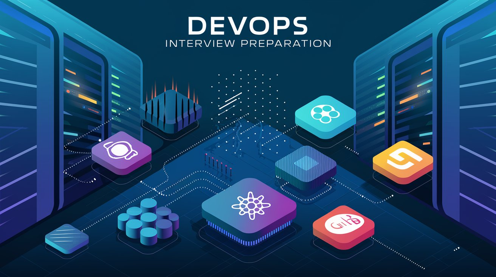

### **README.md**

# DevOps Interview Preparation



---

## 📚 Goal of This Repository

Welcome to the **DevOps Interview Preparation** repository! This repo is designed to help aspiring DevOps engineers prepare for their interviews and master the fundamental and advanced concepts of DevOps. It contains curated learning resources, hands-on projects, and best practices across the entire DevOps lifecycle.

Whether you're a beginner or someone looking to take your DevOps skills to the next level, this repository will guide you step by step through everything you need to know. The sections range from basic Linux skills to advanced topics such as Chaos Engineering, Cloud Security, and CI/CD Automation.

The goal is not only to prepare you for interviews but also to give you hands-on experience with real-world scenarios.

---

## 🗂 Repository Structure

This repository is divided into various sections, each focusing on a different aspect of DevOps. Each section contains comprehensive learning material along with hands-on projects to solidify your understanding.

### Table of Contents:

1. **00-Getting-Started**  
   - Basic concepts, glossary, roadmap, and career paths.

2. **01-Infrastructure-Basics**
   - Learn about Linux fundamentals, networking protocols, and shell scripting with hands-on projects.

3. **02-Version-Control-GitOps**
   - Explore Git and GitOps practices, with projects like implementing GitOps with ArgoCD.

4. **03-CI/CD-Automation**
   - Dive into CI/CD tools like Jenkins, GitHub Actions, GitLab CI, and more with projects.

5. **04-Containers-Orchestration**
   - Master Docker and Kubernetes through hands-on projects.

6. **05-Monitoring-Logging**
   - Implement Prometheus and Grafana for monitoring and ELK Stack for centralized logging.

7. **06-Security-Compliance**
   - Learn DevSecOps practices and Cloud Security strategies.

8. **07-HA-Scaling-Deployment-Strategies**
   - Understand load balancing and scaling strategies with hands-on deployment projects.

9. **08-Cloud-Concepts-(Non-AWS)**
   - Explore Google Cloud Platform (GCP) and Azure fundamentals with projects.

10. **09-Real-World-Case-Studies**
    - Study case studies of DevOps practices at major tech companies.

11. **10-FinOps-Cost-Optimization**
    - Gain insights into cloud cost optimization and best practices.

12. **11-DevOps-Troubleshooting-Guides**
    - Troubleshooting Kubernetes and CI/CD pipelines with detailed guides.

13. **12-Advanced-DevOps-Topics**
    - Dive deep into Chaos Engineering and Service Mesh (Istio) with hands-on projects.

14. **13-Interview-Preparation**
    - Get ready for interviews with common questions, system design challenges, and coding challenges.

---

## ⚙️ How to Use This Repo

### 1. **Start at the beginning**
   - If you're new to DevOps, begin with the "00-Getting-Started" section to understand the core concepts.

### 2. **Hands-on projects**
   - Apply the concepts by working on hands-on projects listed under each topic.

### 3. **Move at your own pace**
   - The sections are arranged in a logical order, but feel free to explore topics according to your interests or needs.

### 4. **Prepare for interviews**
   - Use the "Interview-Preparation" section to get ready for your next DevOps interview!

---

## 🛠 Technologies Covered

The repo covers various DevOps tools and technologies, including but not limited to:

- **Version Control**: Git, GitHub, GitOps (ArgoCD)
- **CI/CD Tools**: Jenkins, GitHub Actions, GitLab CI
- **Automation & Configuration Management**: Ansible, Terraform, Pulumi
- **Containers**: Docker, Kubernetes
- **Monitoring & Logging**: Prometheus, Grafana, ELK Stack
- **Cloud Providers**: AWS, Google Cloud, Azure
- **Security**: DevSecOps, Cloud Security
- **Scalability & High Availability**: Load Balancing, HAProxy, Blue-Green Deployments

---

## 💡 Hands-On Projects

Each section includes hands-on projects to reinforce what you've learned. Here are a few notable projects:

- **Deploy a Linux Monitoring Stack**  
  Learn how to monitor a Linux server using Prometheus and Grafana.

- **CI/CD with GitLab**  
  Set up a complete CI/CD pipeline using GitLab CI.

- **Deploy a Microservice App with Docker**  
  Learn how to containerize applications using Docker.

- **Kubernetes Multi-Cluster Deployment**  
  Deploy Kubernetes across multiple clusters for high availability.

- **Automate User Management with Bash**  
  Use shell scripting to automate system tasks.

---

## 📝 Installation Instructions

To get started with the hands-on projects in this repository, follow these steps:

### Prerequisites

Ensure you have the following tools installed:

- [Docker](https://www.docker.com/)
- [Kubernetes](https://kubernetes.io/)
- [Terraform](https://www.terraform.io/)
- [Git](https://git-scm.com/)
- [Ansible](https://www.ansible.com/)
- [Prometheus & Grafana](https://prometheus.io/)
- [Jenkins](https://www.jenkins.io/)
- [GitHub](https://github.com/)
- [GitLab](https://about.gitlab.com/)
- [AWS](https://aws.amazon.com/)
- [Azure](https://azure.microsoft.com/)
- [Google Cloud Platform (GCP)](https://cloud.google.com/)
- [Nagios](https://www.nagios.org/)
- [Chef](https://www.chef.io/)
- [Puppet](https://puppet.com/)
- [Docker Compose](https://docs.docker.com/compose/)
- [Helm](https://helm.sh/)
- [Istio](https://istio.io/)
- [Consul](https://www.consul.io/)
- [Vault](https://www.vaultproject.io/)
- [Fluentd](https://www.fluentd.org/)
- [ElasticSearch](https://www.elastic.co/elasticsearch/)
- [Nginx](https://www.nginx.com/)
- [HAProxy](http://www.haproxy.org/)

### Steps

1. Clone this repository:

   ```bash
   git clone https://github.com/your-username/devops-interview-prep.git
   cd devops-interview-prep
   ```

2. Follow the instructions in each folder's `README.md` file for project-specific setup.

---

## 🤝 Contribution Guidelines

We welcome contributions! If you want to help improve this repository or add more resources, check out our [CONTRIBUTING.md](./CONTRIBUTING.md).

---

## 🧑‍💻 Community & Support

If you need help or have questions, don't hesitate to reach out! Here are some ways to connect with the community:

- **GitHub Issues**: For bug reports or questions, open an issue on the repository.
- **Discussions**: Join the conversation in the GitHub Discussions section.
- **Slack/Discord**: Join our DevOps community on Slack or Discord for real-time support.

---

## 📝 License

This project is licensed under the MIT License - see the [LICENSE](./LICENSE) file for details.

---

## 🎉 Happy learning! 🚀